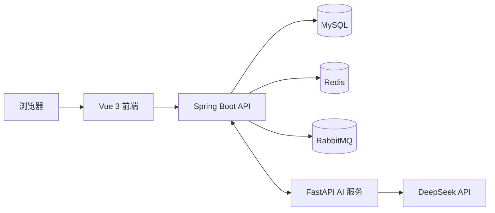

# Sharing Platform（资源分享社区）

一个前后端分离的资源分享社区，支持账号认证、帖子发布、两级评论、点赞、收藏、搜索、互动通知，以及基于 DeepSeek 和 LangChain 的 AI 帖子检索与内容辅助。

## 功能特性

- 邮箱验证码注册、重置密码和 JWT 登录认证
- Spring Security 表单登录、主动登出和 JWT 黑名单
- 验证码限流与全局 IP 流量限流
- 邮件通过 RabbitMQ 异步发送
- 发布资源帖子，支持最新、最热、从旧到新排序
- 帖子与评论两级结构、点赞、收藏、搜索
- 我的发布、我的收藏、失效帖子墓碑页
- 点赞、评论、回复通知，支持未读数、已读和删除
- AI 社区问答、帖子检索、正文概括、评论反馈分析和正文修改草稿

## 技术栈

| 模块 | 技术 |
| --- | --- |
| 前端 | Vue 3、TypeScript、Vite、Element Plus、Vue Router、Axios |
| 后端 | Java 17、Spring Boot 4、Spring Security、MyBatis-Plus、Maven |
| AI 服务 | Python 3.12、FastAPI、LangChain、langchain-openai |
| 数据库 | MySQL 8 |
| 缓存与限流 | Redis 7 |
| 消息队列 | RabbitMQ |
| 大模型 | DeepSeek OpenAI 兼容 API |

## 系统架构



前端默认通过 `http://localhost:8080` 访问后端。后端通过受内部服务令牌保护的接口调用 AI 服务，AI 服务再通过相同令牌访问后端帖子检索和正文接口。

## 目录结构

```text
my-project/
├── my-project-frontend/       Vue 3 前端
├── my-project-backend/        Spring Boot 后端
├── my-project-ai/             FastAPI + LangChain AI 服务
├── docs/
│   ├── sql/                   数据库增量脚本
│   ├── adr/                   架构决策记录
│   └── requirements/          需求记录
└── README.md
```

## 环境要求

- JDK 17+
- Maven 3.9+
- Node.js 22.18+ 或 24.12+
- Python 3.12+
- MySQL 8+
- Redis 7+
- RabbitMQ 3.12+
- DeepSeek API Key

## 快速开始

### 1. 启动 MySQL、Redis 和 RabbitMQ

先准备本机 MySQL，并创建数据库：

```sql
CREATE DATABASE test
    CHARACTER SET utf8mb4
    COLLATE utf8mb4_unicode_ci;
```

数据库脚本位于 `docs/sql/`。这些脚本按编号顺序执行，并建立在已有 `db_account` 表的基础上：

```text
001_community_tables.sql
002_my_pages_favorites_search.sql
003_physical_delete_cleanup.sql
004_favorite_count.sql
005_tombstone_retention.sql
006_notifications.sql
```

Redis 和 RabbitMQ 可以通过 Compose 启动：

```bash
docker compose -f my-project-backend/docker-compose.yml up -d redis rabbitmq
```

RabbitMQ 管理页面默认地址为 `http://localhost:15672`，开发账号和密码在 `my-project-backend/docker-compose.yml` 中配置。

### 2. 启动后端

后端默认监听 `8080` 端口。首次启动前，请检查 `my-project-backend/src/main/resources/application.yml` 中的 MySQL、Redis、RabbitMQ、邮件和 JWT 配置。

```bash
cd my-project-backend
mvn spring-boot:run
```

### 3. 启动前端

前端默认监听 `5173` 端口，接口地址保存在 `my-project-frontend/src/net/index.ts`。

```bash
cd my-project-frontend
npm install
npm run dev
```

生产构建：

```bash
npm run build
```

### 4. 启动 AI 服务

AI 服务默认监听 `8000` 端口，需要先创建本地 `.env`：

```powershell
cd my-project-ai
Copy-Item .env.example .env
```

在 `.env` 中填写：

```dotenv
DEEPSEEK_API_KEY=your-deepseek-api-key
DEEPSEEK_BASE_URL=https://api.deepseek.com
DEEPSEEK_MODEL=deepseek-chat
JAVA_SERVICE_URL=http://127.0.0.1:8080
AI_SERVICE_TOKEN=replace-with-a-shared-local-token
```

安装依赖并启动：

```bash
cd my-project-ai
python -m venv .venv
source .venv/bin/activate
pip install -r requirements.txt
uvicorn app.main:app --host 127.0.0.1 --port 8000
```

Windows PowerShell 激活虚拟环境：

```powershell
.\.venv\Scripts\Activate.ps1
```

健康检查：

```text
GET http://127.0.0.1:8000/health
```

也可以在 VS Code 中打开 `my-project-ai/run_ai.ipynb`，选择项目对应的 Python 内核后，用 Notebook 启动和停止服务。

## 配置说明

- 后端配置：`my-project-backend/src/main/resources/application.yml`
- AI 配置：`my-project-ai/.env`
- 前端 API 地址：`my-project-frontend/src/net/index.ts`
- Java 与 Python 的 `AI_SERVICE_TOKEN` 必须保持一致
- AI 服务调用后端内部接口时，请求头使用 `X-AI-Service-Token`

不要将数据库密码、邮箱授权码、JWT 密钥或模型 API Key 提交到公开仓库。如果密钥曾进入 Git 历史，应立即在对应平台重置。

## 主要接口

| 模块 | 路径 |
| --- | --- |
| 认证 | `/api/auth/**` |
| 当前账号 | `/api/user/me` |
| 帖子 | `/api/post/**` |
| 评论 | `/api/comment/**` |
| 点赞 | `/api/like/**` |
| 收藏 | `/api/favorite/**` |
| 通知 | `/api/notification/**` |
| AI 对话 | `/api/ai/chat` |
| AI 内部接口 | `/internal/ai/**` |

除认证接口和受服务令牌保护的内部接口外，其余请求需要携带：

```http
Authorization: Bearer <jwt>
```

## 测试与构建

后端测试：

```bash
cd my-project-backend
mvn test
```

AI 单元测试：

```bash
cd my-project-ai
python -m unittest discover -s tests
```

前端类型检查与生产构建：

```bash
cd my-project-frontend
npm run build
```

## 开发文档

- `docs/adr/`：架构决策记录
- `docs/requirements/`：需求记录
- `docs/sql/`：数据库增量脚本
